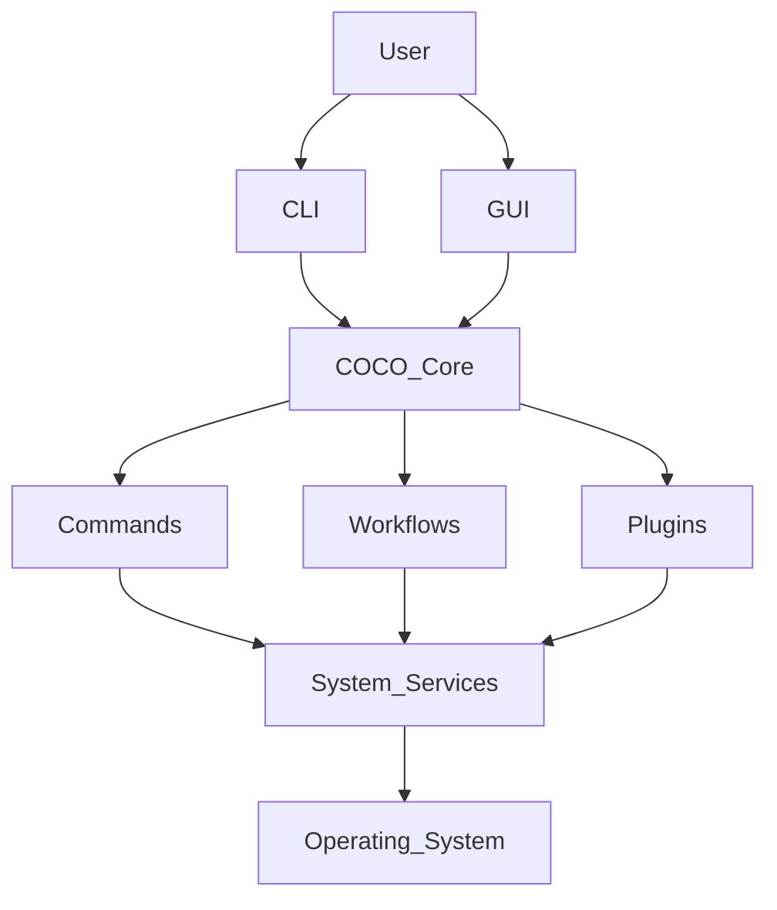

# Coco
> Cross-platform Operations &amp; Command Orchestrator

**Coco** is a cross-platform automation platform designed to simplify the way people interact with their computers.

At its core, **Coco** is a single automation engine that powers multiple interfaces such as a CLI(for devs) and a GUI(for all). Rather than replacing the tools people already use, **Coco** orchestrates and coordinates them through a single, unified, and extensible platform.

## Mission

Our mission is to reduce the complexity of not only the *development experience* but also using computers as a whole to optimize for **human experience** over any other metric. This is done by creating a platform that automates repetitive tasks, streamlines workflows, and provides a consistent experience across development, productivity, and everyday computing.

Developers should spend less time configuring environments and remembering commands.

Everyone else should spend less time searching for files, organizing data, installing software, and troubleshooting common computer problems.

## What is Coco?

**Coco** is an automation platform built around a single core engine.

The core engine is responsible for understanding projects, workflows, system information, and user actions. Every interface communicates with this engine, ensuring consistent behavior across the entire platform.

The project is being designed from the ground up with extensibility, modularity, and long-term maintainability in mind.

## Key Features

### Developer Experience
* Intelligent project detection
* Development environment diagnostics
* Workflow automation
* Project execution
* Plugin ecosystem
* Deployment orchestration
* Local development tooling
* Cross-platform support

### General Productivity
* Computer diagnostics
* Storage cleanup
* Duplicate file detection
* File organization
* Universal search
* Software installation
* Productivity workflows
* Desktop automation
* System maintenance

### Future Features
* AI-powered assistants
* Cloud synchronization
* Marketplace for plugins and workflows
* Team collaboration
* Cross-device configuration syncing
* Community plugin ecosystem

## Architecture

**Coco** follow a "one engine, many interfaces" architecture.

All business logic lives inside the core engine.

The CLI, desktop application, and any future APIs simply communicate with the engine.

## Project Structure
```text
coco/
│
├── docs/
├── coco-cli/
├── coco-core/
├── coco-plugin-api/
├── coco-gui/
├── coco-plugins/
├── examples/
├── build.gradle
├── settings.gradle
└── README.md
```

## Project Principles
The following principles guide every architectural decision made throughout the project.
* One engine powers every interface.
* Business logic never belongs in the user interface.
* Automation should simplify existing workflows rather than replace existing tools.
* Features should be modular and easily extensible.
* Cross-platform compatibility is a first-class requirement.
* AI enhances the platform but is never required to use it.
* Simplicity is preferred over unnecessary complexity.

## Roadmap
### Version 0.1
* Command framework
* System diagnostics
* Project detection
* Intelligent command execution
* Basic workflow engine
### Version 0.2
* Plugin system
* Configuration management
* Workflow improvements
* Project templates
### Version 0.3
* Desktop application
* File management tools
* Productivity features
### Version 0.4
* AI integrations
* Cloud synchronization
* Marketplace
* Team features

## Contributing

**Coco** is being developed as a long-term open-source platform.

Before contributing, please review the documentation contained within the docs/ directory. Every major architectural decision is documented to ensure the project remains consistent as it grows.

---
**Coco**

*Build once. Automate everything.*
